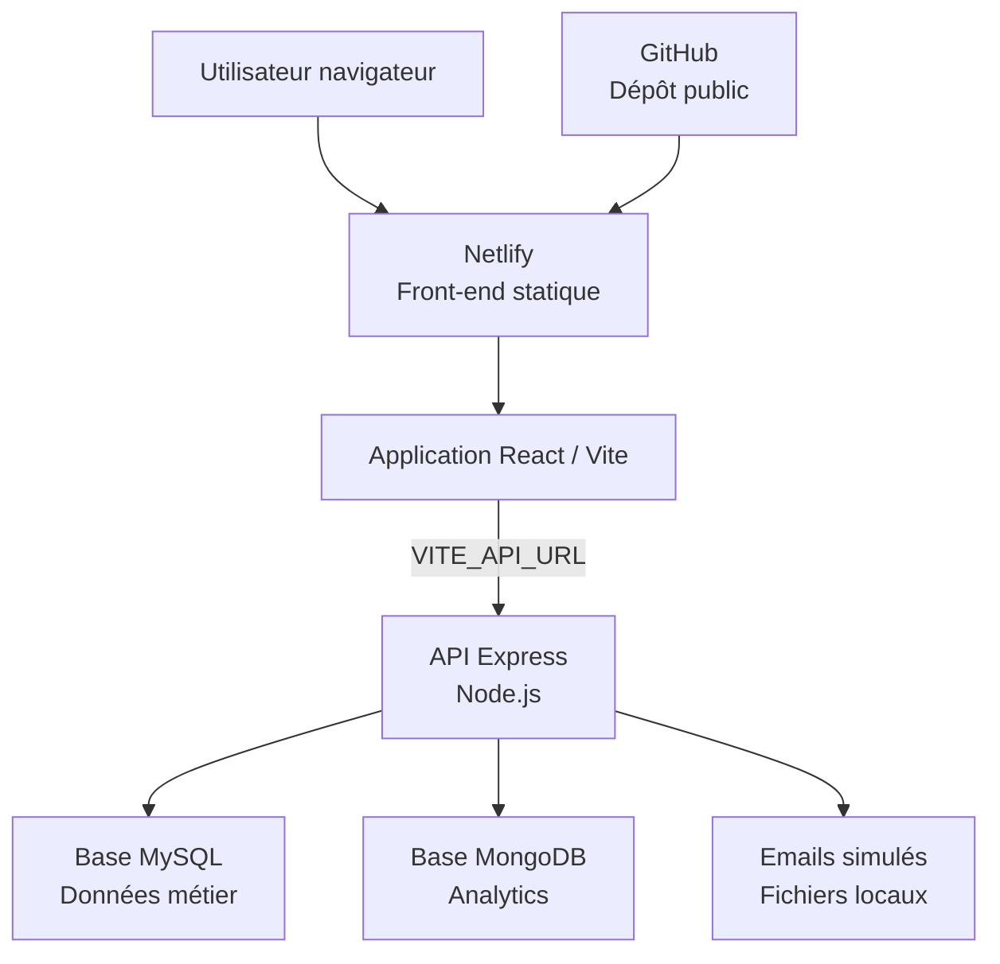
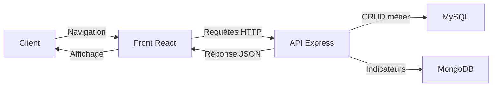

# Architecture technique - Vite & Gourmand

## Objectif

Ce document presente l'architecture technique globale du projet Vite & Gourmand.

## Diagramme Mermaid



## Description

Le projet est separe en plusieurs blocs :

- le depot GitHub contient le code source ;
- Netlify publie le front-end statique ;
- React/Vite fournit l'interface utilisateur ;
- l'API Express gere les routes metier ;
- MySQL stocke les donnees relationnelles ;
- MongoDB stocke les donnees analytics ;
- les emails sont simules sous forme de fichiers locaux.

## Deploiement

Le front-end est deployable sur Netlify avec :

```text
Commande de build : npm run build
Dossier de publication : dist
```

Point important :

```text
L'API Express doit etre hebergee separement pour une production complete.
```

## Variables importantes

| Variable | Role |
| --- | --- |
| `VITE_API_URL` | URL de l'API consommee par le front-end. |
| `CLIENT_URL` | URL du front autorisee par CORS cote API. |
| `JWT_SECRET` | Secret utilise pour signer les tokens JWT. |
| `MYSQL_*` | Parametres de connexion MySQL. |
| `MONGO_URI` | URI de connexion MongoDB. |

## Flux principal



## Conclusion

L'architecture respecte une separation claire entre l'interface, l'API et les bases de donnees. Elle permet de repondre aux contraintes ECF avec une base relationnelle, une base non relationnelle et une documentation de deploiement.
