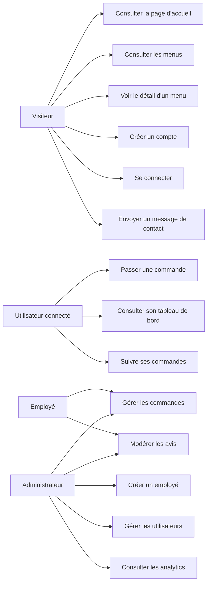

# Diagramme de cas d'utilisation - Vite & Gourmand

## Objectif

Ce diagramme presente les interactions principales entre les acteurs et l'application.

## Diagramme Mermaid

## Acteurs

| Acteur | Description |
| --- | --- |
| Visiteur | Personne non connectee qui consulte l'application. |
| Utilisateur connecte | Client disposant d'un compte. |
| Employe | Personnel interne pouvant gerer commandes et avis. |
| Administrateur | Responsable de la gestion des utilisateurs et des analytics. |

## Notes

- L'administrateur herite de droits plus larges que l'employe.
- Les fonctionnalites sensibles necessitent une authentification.
