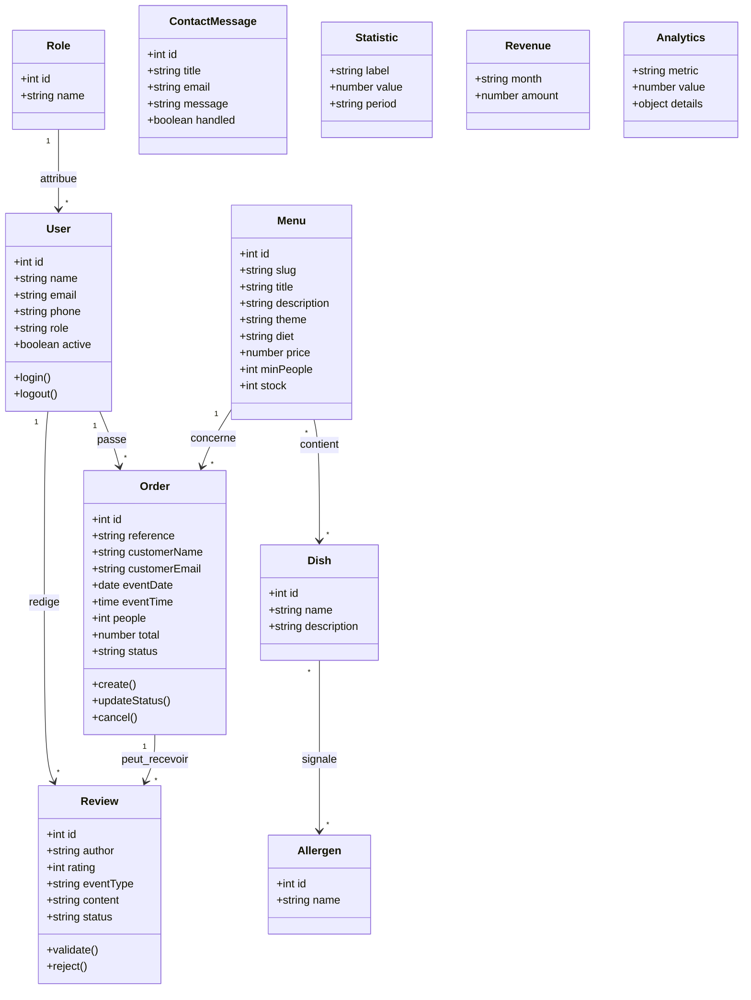

# Diagramme de classes - Vite & Gourmand

## Objectif

Ce diagramme represente les principales classes ou entites manipulees par l'application.

## Diagramme Mermaid

## Notes

- Les classes `Statistic`, `Revenue` et `Analytics` correspondent aux modeles NoSQL.
- Les autres classes representent principalement les entites SQL et les objets manipules par l'application.
