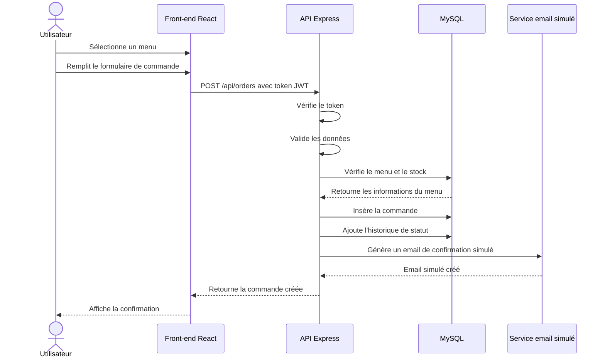

# Diagramme de sequence - Passage d'une commande

## Objectif

Ce diagramme de sequence represente le parcours de creation d'une commande par un utilisateur connecte.

## Diagramme Mermaid

## Etapes principales

1. L'utilisateur choisit un menu.
2. Il remplit les informations de commande.
3. Le front-end envoie la demande a l'API.
4. L'API verifie l'authentification.
5. L'API controle les donnees et le menu.
6. La commande est inseree en base SQL.
7. Un historique de statut est cree.
8. Un email simule est genere.
9. Le front-end affiche la confirmation.

## Notes

- Le token JWT protege la route de creation de commande.
- La commande est stockee dans MySQL.
- L'email est simule par fichier local dans le fonctionnement actuel.
