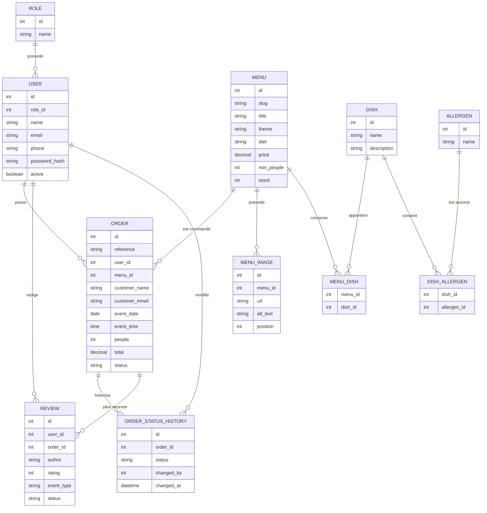

# MCD - Modele Conceptuel de Donnees

## Objectif

Ce document presente le modele conceptuel de donnees du projet Vite & Gourmand.

Le MCD represente les principales entites metier et leurs relations.

## Diagramme Mermaid

## Notes

- Les utilisateurs sont rattaches a un role.
- Les commandes sont rattachees a un menu et peuvent etre rattachees a un utilisateur.
- Les menus peuvent contenir plusieurs plats.
- Les plats peuvent contenir plusieurs allergenes.
- Les avis peuvent etre lies a une commande et a un utilisateur.
- L'historique des statuts permet de suivre l'evolution d'une commande.
